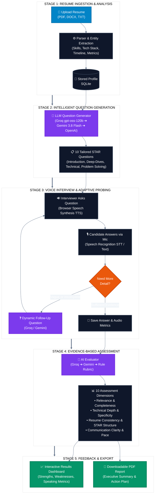

# ResumeFlow — Interview Studio

A premium resume-based voice interview platform. Candidates upload their resume, receive personalized interview questions based on their experience, conduct the interview using voice, and receive a detailed assessment report with a downloadable PDF.

---

## Features

- **Resume Upload & Parsing** — Supports PDF, DOCX, TXT with intelligent extraction of skills, experience, projects, achievements, and more
- **Personalized Interviews** — Questions generated entirely from the candidate's resume content
- **Voice Interview** — Real-time speech-to-text with professional interviewer voice
- **Dynamic Follow-ups** — AI-generated follow-up questions based on answer quality
- **Live Transcript** — Optional real-time transcript during the interview
- **Evidence-Based Evaluation** — Scoring across 10 dimensions with transcript evidence
- **Results Dashboard** — Detailed scorecard, strengths, improvements, communication analysis
- **PDF Report** — Professional downloadable assessment report
- **Text Fallback** — Type answers when voice input is unavailable
- **Privacy-First** — Consent before recording, audio not stored, environment variable secrets

---

## Architecture

```
ResumeFlow Interview Studio/
├── backend/
│   ├── app.py                  # FastAPI REST server & API endpoints
│   ├── database.py             # SQLAlchemy SQLite models
│   ├── models.py               # Pydantic data models
│   ├── resume_parser.py        # Resume text extraction & analysis
│   ├── interview_generator.py  # Question & follow-up generation
│   ├── evaluator.py            # Answer scoring & evaluation
│   └── pdf_generator.py        # PDF report generation (reportlab)
├── frontend/
│   ├── index.html              # Single-page application
│   └── static/
│       ├── css/
│       │   └── style.css       # Premium design system
│       └── js/
│           ├── app.js          # Application logic & state management
│           └── speech.js       # Voice handling, waveform, STT/TTS
├── engine/
│   ├── evaluator.c             # Legacy C evaluator (unused)
│   └── Makefile
├── requirements.txt
├── Dockerfile                  # Hugging Face Spaces (Docker) deployment
├── run.sh                      # Local run script (port 8005)
├── .env.example
└── README.md
```

---

## Stack

- **Backend**: Python 3.10+ / FastAPI / SQLAlchemy / SQLite
- **Frontend**: HTML5 / CSS3 / Vanilla JavaScript (ES6)
- **Voice**: Web Speech API (browser-native STT & TTS)
- **PDF**: reportlab (server-side)
- **Resume Parsing**: pdfplumber / python-docx
- **LLM Engine**: Multi-tier orchestration (Groq `openai/gpt-oss-120b`, Google Gemini `gemini-3.8-flash`, OpenAI `gpt-4o-mini`, with rule-based fallback)
- **Deployment**: Docker (Hugging Face Spaces ready)

---

## AI Interview & Evaluation Pipeline





---

## Quick Start

### 1. Install Dependencies

```bash
pip install -r requirements.txt
```

### 2. Configure Environment

```bash
cp .env.example .env
# Edit .env to add optional API keys
```

### 3. Start the Server

Using the run script (recommended, port 8005):

```bash
./run.sh
```

Or directly with uvicorn:

```bash
uvicorn backend.app:app --host 127.0.0.1 --port 8005 --reload
```

### 4. Open the Application

Navigate to: [http://127.0.0.1:8005](http://127.0.0.1:8005)

---

## Deployment (Docker)

The repo ships with a `Dockerfile` ready for [Hugging Face Spaces](https://huggingface.co/spaces) (see `README.space.md`) or any Docker host:

```bash
docker build -t resumeflow .
docker run -p 7860:7860 -e GROQ_API_KEY=your_key resumeflow
```

The container serves on port `7860` and runs as a non-root user with a writable SQLite database inside `/app`.

---

## Environment Variables

| Variable | Required | Description |
|----------|----------|-------------|
| `GROQ_API_KEY` | No | Fast inference tier. Enables Groq LLM-powered question generation, follow-ups, and evaluation |
| `GROQ_MODEL` | No | Override the Groq model (default: `openai/gpt-oss-120b`) |
| `GEMINI_API_KEY` | No | Google Gemini API key. Powers high-reasoning question generation, live follow-ups, and answer evaluation |
| `GEMINI_MODEL` | No | Override the Gemini model (default: `gemini-3.8-flash`) |
| `OPENAI_API_KEY` | No | OpenAI fallback if other providers are not set |
| `PORT` | No | Server port (default: 8005 locally, 7860 in Docker) |
| `HOST` | No | Server host (default: 127.0.0.1) |


The application works fully without any API keys. LLM keys enhance question quality but the rule-based fallback provides a complete experience.

---

## User Flow

1. **Landing Page** — Premium career-assessment landing with "Start My Interview" CTA
2. **Resume Upload** — Drag-and-drop or file picker for PDF/DOCX/TXT
3. **Resume Review** — View and verify extracted information before interview
4. **Voice Interview** — 8-12 personalized questions with dynamic follow-ups
5. **Results Dashboard** — Comprehensive scorecard with strengths and improvements
6. **PDF Report** — Downloadable professional assessment report

---

## API Endpoints

| Method | Endpoint | Description |
|--------|----------|-------------|
| `GET` | `/api/health` | Health check |
| `POST` | `/api/resume/upload` | Upload and parse resume (PDF/DOCX/TXT) |
| `POST` | `/api/resume/upload-text` | Upload resume as raw text |
| `GET` | `/api/resume/{id}` | Get parsed resume data |
| `PUT` | `/api/resume/{id}` | Update resume information |
| `POST` | `/api/interview/start` | Start interview session |
| `GET` | `/api/interview/{id}` | Get interview status |
| `POST` | `/api/interview/answer` | Submit answer |
| `POST` | `/api/interview/end` | End interview & evaluate |
| `GET` | `/api/interview/{id}/results` | Get full results |
| `GET` | `/api/interview/{id}/pdf` | Download PDF report |
| `GET` | `/api/interview/{id}/transcript` | Download transcript (TXT/JSON) |
| `DELETE` | `/api/interview/{id}` | Delete session |

---

## Privacy

- Audio is processed locally in the browser and never sent to the server
- Only text transcripts are stored for evaluation
- Microphone consent is required before any recording
- Sessions can be deleted via the API
- API keys are stored in environment variables, never in frontend code
- File uploads are validated by type and size
- Extracted text is sanitized before storage
