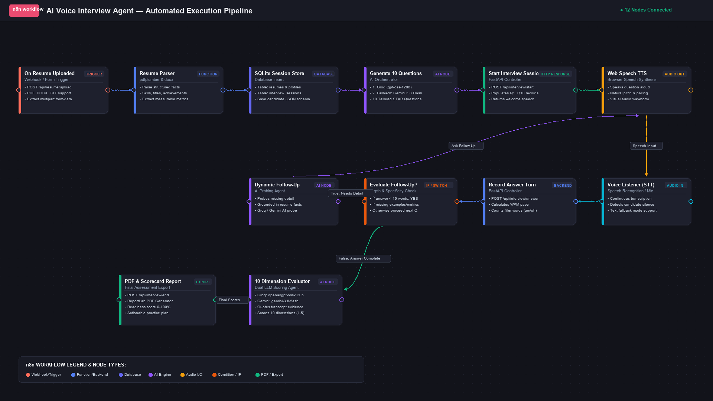

# ResumeFlow — Documentation & Engineering Wiki

Welcome to the comprehensive architecture and developer guide for **ResumeFlow (AI Voice Interview Studio)**.

This documentation is written from a **first-person creator perspective** ("I built this system to solve...") so that you can thoroughly understand, present, explain, and extend every part of the codebase as your own project.

---

## Documentation Index

| Document | Topic & Focus Area |
| :--- | :--- |
| **[01_SYSTEM_OVERVIEW.md](file:///Users/yuvii/Ai-voice-agent/docs/01_SYSTEM_OVERVIEW.md)** | High-level system design, motivation, core innovations, and full execution architecture. |
| **[02_TECH_STACK.md](file:///Users/yuvii/Ai-voice-agent/docs/02_TECH_STACK.md)** | Deep-dive into every technology, framework, library, and tool used across frontend and backend. |
| **[03_BACKEND_ARCHITECTURE.md](file:///Users/yuvii/Ai-voice-agent/docs/03_BACKEND_ARCHITECTURE.md)** | FastAPI server, SQLite database schema, REST API endpoints, and business controllers. |
| **[04_FRONTEND_ARCHITECTURE.md](file:///Users/yuvii/Ai-voice-agent/docs/04_FRONTEND_ARCHITECTURE.md)** | Single-Page Application (SPA) architecture, CSS design system, and state management. |
| **[05_VOICE_AND_AI_PIPELINE.md](file:///Users/yuvii/Ai-voice-agent/docs/05_VOICE_AND_AI_PIPELINE.md)** | Browser Web Speech API (TTS/STT), Groq, Google Gemini, adaptive follow-ups, and AI fallback tiers. |
| **[06_EVALUATION_AND_SCORING.md](file:///Users/yuvii/Ai-voice-agent/docs/06_EVALUATION_AND_SCORING.md)** | The 10 assessment dimensions, evidence-grounded scoring, STAR rubric, and PDF generator. |
| **[07_DEVELOPER_GUIDE.md](file:///Users/yuvii/Ai-voice-agent/docs/07_DEVELOPER_GUIDE.md)** | Project structure, environment variables, local execution, Docker deployment, and troubleshooting. |
| **[08_CODEBASE_WALKTHROUGH.md](file:///Users/yuvii/Ai-voice-agent/docs/08_CODEBASE_WALKTHROUGH.md)** | Plain-English explanation of every file, every design decision, and the full end-to-end request journey. **Start here if you are new to the codebase.** |

---

## Visual Architecture Overview

Here is the visual n8n-style execution pipeline of the system:

---

## Core Philosophy of This Project

1. **Zero-Latency Feel**: By offloading Speech-to-Text and Speech-Synthesis to native browser APIs (`webkitSpeechRecognition` & `speechSynthesis`), user voice is processed without expensive audio upload bandwidth.
2. **Multi-Tier AI Resilience**: LLM capabilities are orchestrated across **Groq** (`openai/gpt-oss-120b`), **Google Gemini** (`gemini-3.8-flash`), and deterministic rule-based algorithms to guarantee 100% uptime with sub-second feedback.
3. **Objective Evidence Scoring**: Unlike generic "good/bad" scorecards, every score is grounded with exact quotes from the candidate's transcript and checked against their resume claims.
